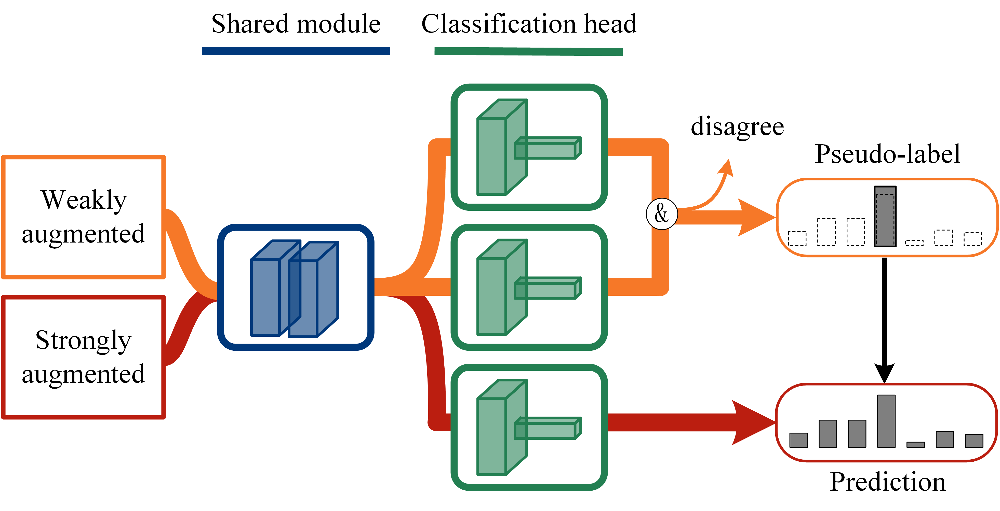

# Semi-Supervised Learning with Multi-Head Co-Training (PyTorch)



## Abstract
Co-training, extended from self-training, is one of the frameworks for semi-supervised learning. Without natural split of features, single-view co-training works at the cost of training extra classifiers, where the algorithm should be delicately designed to prevent individual classifiers from collapsing into each other. To remove these obstacles which deter the adoption of single-view co-training, we present a simple and efficient algorithm Multi-Head Co-Training. By integrating base learners into a multi-head structure, the model is in a minimal amount of extra parameters. Every classification head in the unified model interacts with its peers through a “Weak and Strong Augmentation” strategy, in which the diversity is naturally brought by the strong data augmentation. Therefore, the proposed method facilitates single-view co-training by 1).  promoting diversity implicitly and 2). only requiring a small extra computational overhead. The effectiveness of MultiHead Co-Training is demonstrated in an empirical study on standard semi-supervised learning benchmarks.  

## Experiments

First, please make sure your pytorch version is above 1.6.
Then run the train.py, such as

```
$ python train.py --num_labels 4000 --save_name cifar10_4000 --dataset cifar10 --overwrite --data_dir path-to-your-data
```
## Reference
Most of codes in this repository are modified from:
["https://github.com/google-research/fixmatch"](https://github.com/google-research/fixmatch),
["https://github.com/LeeDoYup/FixMatch-pytorch"](https://github.com/LeeDoYup/FixMatch-pytorch),
["https://github.com/ildoonet/pytorch-randaugment"](https://github.com/ildoonet/pytorch-randaugment).
